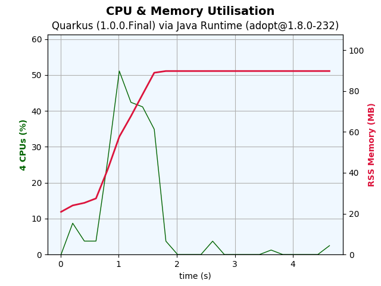
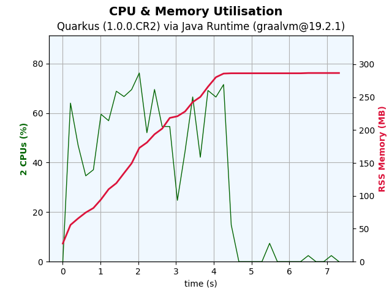
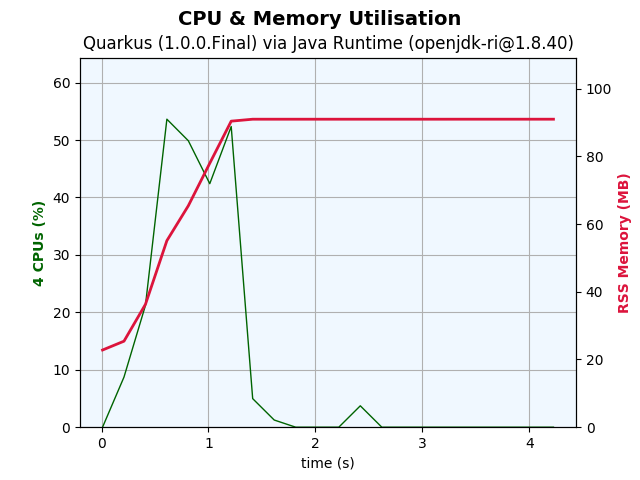
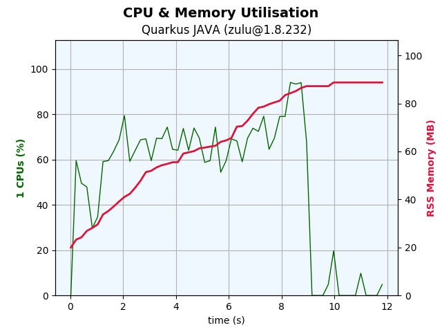
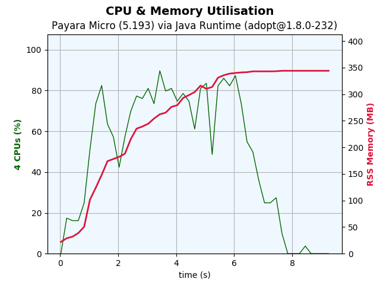
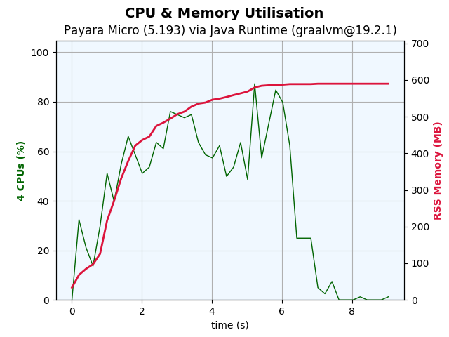
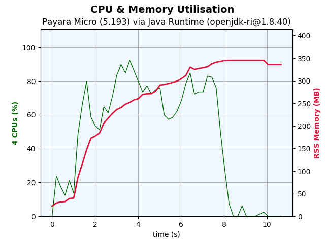
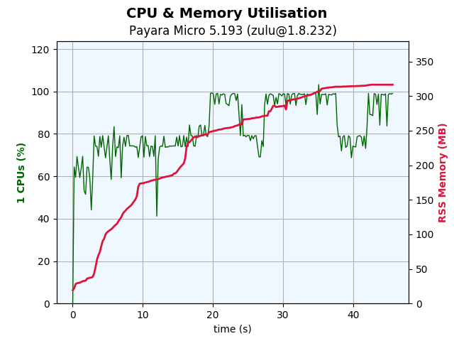

# Comparing the CPU/Memory utilisation of a JAX-RS application (Quarkus, Payara Micro)

Some scripts to measure the CPU and Memory utilisation of JAX-RS appliations.
The performance test runs inside a docker container.

The test uses two demo projects.

* **demo-payara** contains a simple JAX-RS application packaged as uber-jar with Payara Micro application server
* **demo-quarkus** contains a simple Quarkus application packaged as jar and additionally compiled as native image using the GraalVM Native Image

## Prepare and start plot-tests

1) Modify the **Dockerfile** (look for PROXY) to use a proxy server or not
2) Build the docker image with ```env_build.sh``` or ```env_build.cmd```
3) Run the image in a new docker container with ```env_run.sh``` or ```env_run.cmd```
4) Build the demo projects inside the docker container with ```./build.sh```
5) Run the tests inside the docker container with ```./test-all.sh```
6) Plots are generated to directory ```plots```
7) Logs are generated to directory ```logs```

## Test scenario

The **plot-test** consists of the following actions:

* starting the application (simple JAX-RS application)
* start a loop with 3 iterations
  * sleep 1 second
  * send http request using curl to the JAX-RS endpoint

## Plots

All plots are generated on my Notebook inside the running docker container.

Docker Host Machine:

* CPU: Intel i7-8650U 1.90GHz (8 cores)
* RAM: 16GB

Docker Engine Configuration:

* CPUs: 4
* Memory: 8 GB

### Quarkus via GraalVM Native Image


### Quarkus via Java Runtime

| | | |
|-|-|-|
|  |  |  |
|  |  | |

### Payara Micro via Java Runtime

| | | |
|-|-|-|
|  |  |  |
|  |  | |

## Used Runtimes, Frameworks and Libraries

* Quarkus - <https://quarkus.io>
* GraalVM - <https://www.graalvm.org>
* OpenJ9 - <https://www.eclipse.org/openj9>
* OpenJDK RI - <https://jdk.java.net/java-se-ri/8>
* Adopt OpenJDK - <https://adoptopenjdk.net/>
* Zulu OpenJDK - <https://www.azul.com/products/zulu-community>
* Payara Micro - <https://www.payara.fish>
* psrecord - <https://github.com/astrofrog/psrecord>
* psutil - <https://psutil.readthedocs.io>
* matplotlib - <https://matplotlib.org>
* jabba - <https://github.com/shyiko/jabba>
