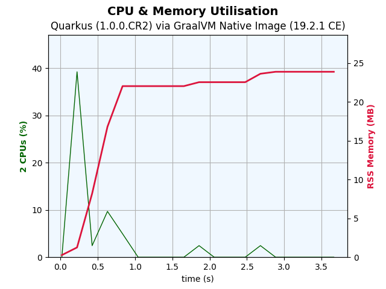
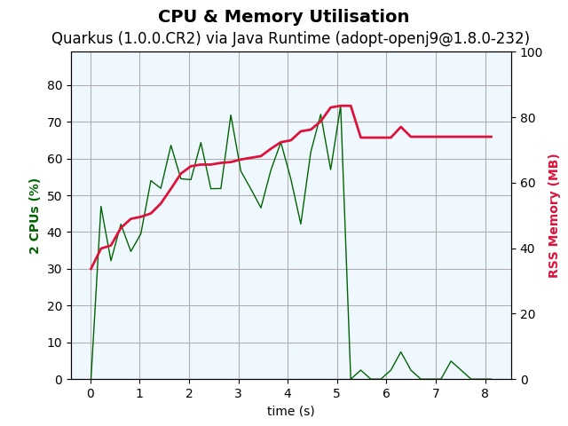
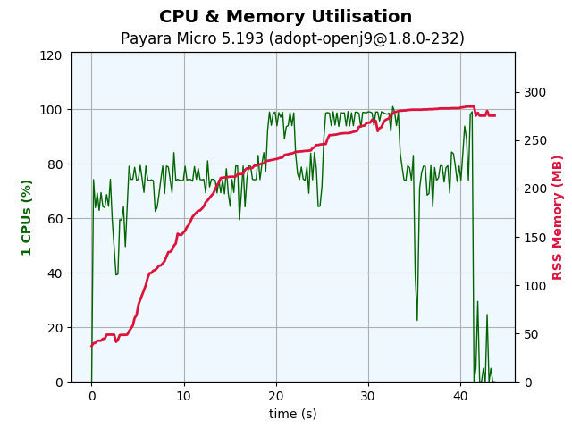

# Quarkus Performance Measurements

Some scripts for memory usage and boot-time measurement.

## Prepare and start plot-tests

1) Modify the **Dockerfile** (look for PROXY) to use a proxy server or not
2) Build the docker image with ```env_build.sh``` or ```env_build.cmd```
3) Run the docker image with ```env_run.sh``` or ```env_run.cmd```
4) Build the demo projects inside docker with ```./build.sh```
5) Run plot tests with ```./plot-test-all.sh```

## Plots

The **plot-test** consists of the following actions:

* starting the application or server
* start a loop (3 iterations)
  * sleep 1 second
  * send http request to the JAX-RS endpoint




